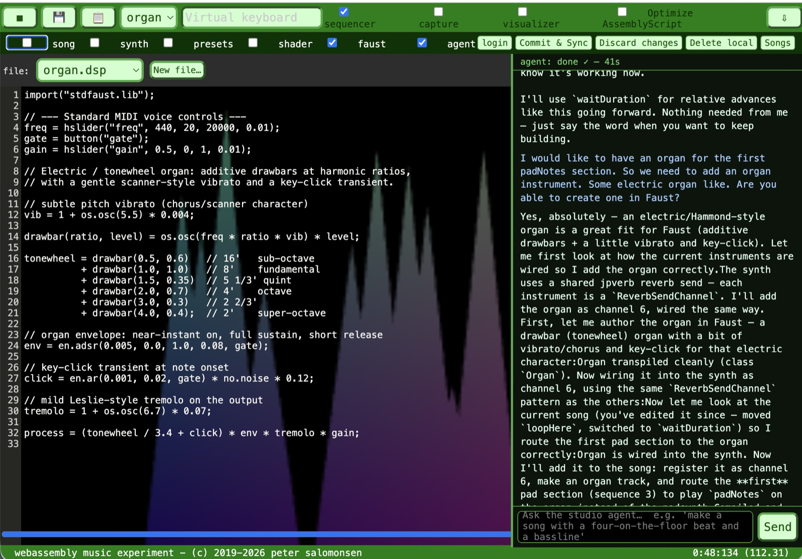
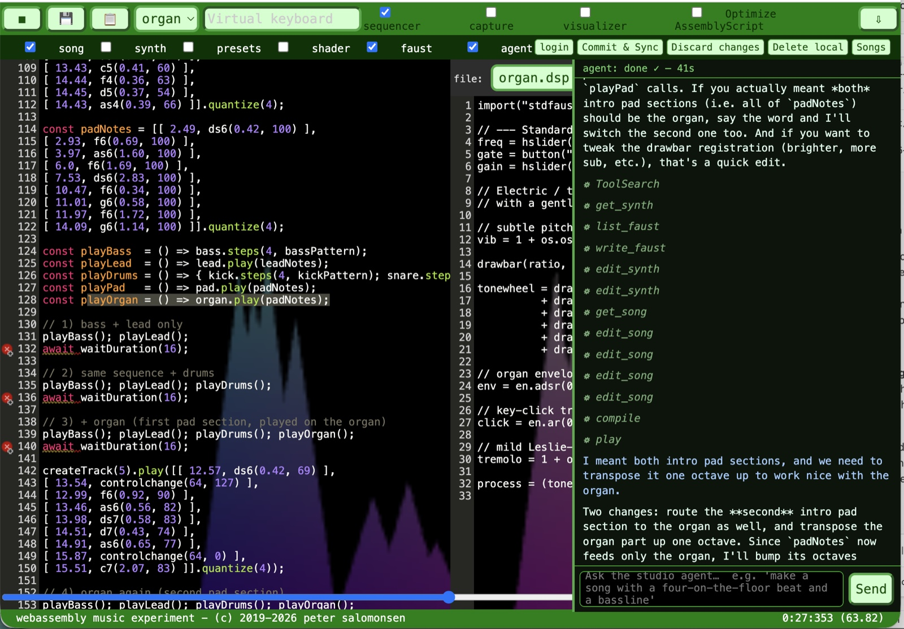
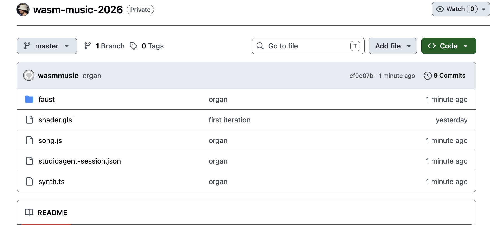
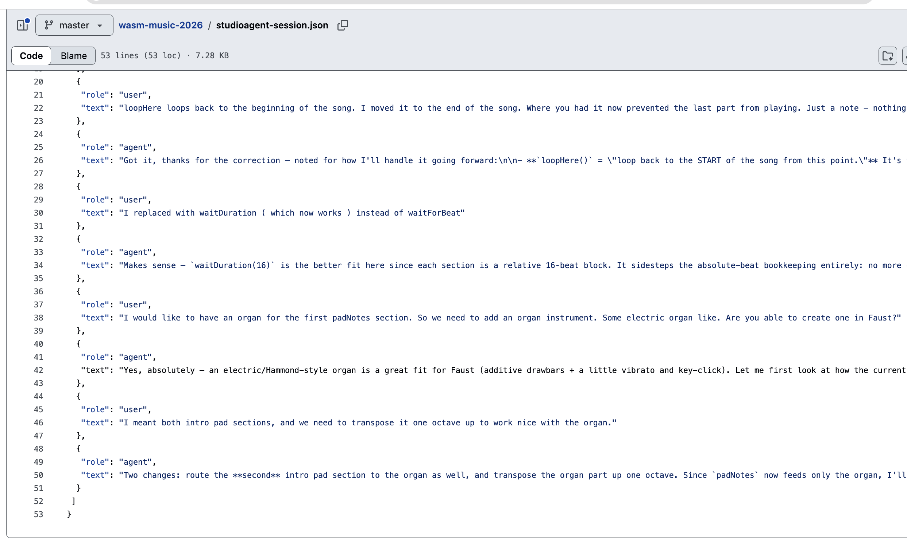

# Agentic Composition

*Making music by talking to an AI — the notes, the arrangement, and even the
instruments — live in the browser.*

Code turns out to be one of the best ways to make music **with** an AI.
Everything you'd write on a score — notes, durations, rests, beats, melodies —
maps cleanly onto a few lines of JavaScript with a small, purpose‑built
vocabulary. And code is exactly what large language models are good at: it's
precise, versionable and editable — right down to the instruments themselves.

So instead of dragging notes around a piano roll, you just *talk*. You describe
what you want in plain language and the agent writes, edits and reorganises the
code for you. It doesn't stop at the notes, either — it can build the
**instruments** themselves, which are just mathematical functions, expressed in
the [Faust](https://faust.grame.fr/) DSP language.

Here it is authoring an electric tonewheel organ in Faust, from a single
sentence:

Then we ask it to fold that organ into the arrangement — it rewrites the song,
routes the right sections to the new instrument, and plays it back:

**But make no mistake — I'm still the composer.** This isn't Suno or a diffusion
model, where you type a prompt and a finished track is handed back as an opaque
blob of audio. I'm directing every part of it: I decide the arrangement, I play
patterns in on my MIDI keyboard, and where I want something specific I read and
edit the code myself. The AI is a collaborator that writes and reorganises code
on my instructions — not a machine that composes *for* me.

And that sequencer code is refreshingly approachable — `setBPM(140)`,
`addInstrument('bass')`, a track of notes and durations. You don't have to be a
programmer to follow the song, and if you're curious it's a gentle way into
reading code at all. The music gives you a reason to.

Everything compiles to **WebAssembly** and runs live in the browser — the
synthesis, the sequencing, and the reactive visuals behind it. The agent runs on
a Claude subscription (no API keys), and every action it takes happens right
there in the app: write the instrument, wire it into the synth, edit the song,
compile, play.

The whole project is a git repository. Because the app embeds **wasm‑git**, you
can push your sources straight to your own GitHub — the songs, the synth, the
Faust instruments — with nothing stored on your behalf:

And because the collaboration itself is worth keeping, even the AI conversation
is saved into the repo — so it travels with the project, and you can pick the
session back up on reload:

And the teaser video for this piece? Made the same way. The visuals are a
music‑reactive shader plus a timed sequence — code the agent wrote — rendered
live in the browser and captured straight from the app. No video editor: the
audio and the visuals were exported from the page and joined with a single
`ffmpeg` command. The trailer for an agentic composition, agentically composed.

It's all open source — the app, the synth engine, the Faust instruments and
every song. Come make something:
**[github.com/petersalomonsen/javascriptmusic](https://github.com/petersalomonsen/javascriptmusic)** 🎛️🎶
